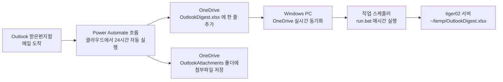

# outlook-mail-digest

Outlook 메일함에서 이메일 데이터(제목/발신자/본문/첨부 등)를 추출해 정리하는 도구

## 전체 흐름도

메일이 도착하면 사람 개입 없이 아래 순서로 자동 처리됩니다.



- **클라우드 단계 (자동)**: Power Automate가 메일 도착을 감지해 Excel과 첨부파일을 OneDrive에 저장합니다. Outlook이나 PC가 꺼져 있어도 동작합니다.
- **PC 단계 (최초 1회 설정 후 자동)**: OneDrive 동기화 + Windows 작업 스케줄러가 주기적으로 `tiger02.lge.com` 서버로 파일을 전달합니다.
  - **아직 시간이 없어 시험 / 확인은 하지 못함. 디자인과 코드만 있음**
- 각 구성 요소의 자세한 원리는 [my_outlook_power_automate_setup.md](my_outlook_power_automate_setup.md) 1절 참고.

## 🚀 Getting Started (처음 시작하기)

Power Automate 화면에서 액션을 하나씩 직접 만들 필요 없이, 이미 완성되어 동작이 검증된 흐름 파일 [Get_Outlook_Mail_20260728014316.zip](Get_Outlook_Mail_20260728014316.zip)을 **가져오기(Import)** 만 하면 바로 쓸 수 있습니다.

### 0. 시작 전 확인할 것

- [ ] 회사 Microsoft 365 계정으로 아래에 로그인할 수 있는지 확인
  - `https://make.powerautomate.com` (Power Automate)
  - OneDrive for Business (`https://onedrive.live.com` 또는 `office.com` → OneDrive)
  - 메일이 도착하는 Outlook 계정 (위와 같은 계정)
- [ ] 이 저장소를 내려받아서 [Get_Outlook_Mail_20260728014316.zip](Get_Outlook_Mail_20260728014316.zip) 파일을 로컬에서 찾을 수 있는지 확인
- [ ] (tiger02 서버로 자동 전달까지 받고 싶다면) 회사 Windows PC에 OneDrive 앱이 로그인되어 있고, `tiger02.lge.com` 서버에 SSH로 접속 가능한 계정이 있는지 확인

### 1. Power Automate 흐름 가져오기 (Import)

1. `https://make.powerautomate.com` 접속 → 왼쪽 메뉴 **"My flows"** → **"Import"**
2. 이 저장소의 [Get_Outlook_Mail_20260728014316.zip](Get_Outlook_Mail_20260728014316.zip) 파일 업로드
3. 화면에 뜨는 연결(Connections) 목록(`Office 365 Outlook`, `Excel Online (Business)`, `OneDrive for Business`) 각각에서 **"Select during import" → "Create new"** 선택 → **본인 회사 계정으로 로그인**
   - ⚠️ 이 단계를 빠뜨리면 원작성자의 메일함/OneDrive를 계속 감시하게 됩니다. 반드시 본인 계정으로 새로 연결하세요.
4. **"Import"** 클릭 → 완료되면 흐름이 자동으로 **켜짐(On)** 상태가 됩니다.
5. 흐름 안에 포함된 자동 준비 로직 덕분에, Excel 파일(`OutlookDigest.xlsx`)과 첨부파일 폴더(`OutlookAttachments`)를 본인 OneDrive에 따로 만들 필요가 없습니다. 흐름을 켜는 순간 자동으로 준비됩니다.

(더 자세한 절차는 [my_outlook_power_automate_setup.md](my_outlook_power_automate_setup.md#0-빠른-시작-이미-만들어진-흐름을-그대로-가져오기) 0절 참고)

### 2. (선택) tiger02 서버로 자동 전달까지 설정하기

Excel 파일을 OneDrive에만 두지 않고 `tiger02.lge.com` 서버로도 주기적으로 자동 전달받고 싶다면, Windows PC에서 아래를 한 번만 실행합니다.

```powershell
cd C:\path\to\outlook-mail-digest
run.bat
```

- `uv` 설치, SSH 키 생성/서버 등록, 작업 스케줄러 등록(매시간 실행), 첫 파일 전송까지 [run.bat](run.bat) + [sync_outlook_digest.py](sync_outlook_digest.py)가 전부 알아서 처리합니다.
- 이미 등록된 부분(키, 작업 스케줄러 등)은 건너뛰므로 여러 번 실행해도 안전합니다.
- 자세한 내용은 [my_outlook_power_automate_setup.md](my_outlook_power_automate_setup.md) 7절 참고.

### 3. 확인하는 방법

1. Power Automate 흐름 화면에서 **"Test" → "Manually" → "Test"** 클릭
2. 자기 자신에게 **첨부파일을 하나 붙여서** 테스트 메일 발송
   - ⚠️ 이 흐름은 **받은편지함(Inbox)에 도착한 메일만** 감지합니다. 스팸함(Junk Email)으로 자동 분류되거나, Outlook 규칙(rule)이 도착 즉시 다른 폴더로 이동시키는 메일은 Inbox를 거치지 않으므로 처리되지 않습니다. 테스트 메일이 필터링 규칙 없이 Inbox에 그대로 남는지 확인하세요.
3. 잠시 후 Power Automate에서 흐름 실행이 초록색 체크(성공)로 표시되는지 확인
4. OneDrive의 `OutlookDigest.xlsx`를 열어 새 행이 추가됐는지 확인 (받은시각/보낸사람/제목/본문/받는사람/첨부파일명 모두 채워져야 함)
5. OneDrive의 `OutlookAttachments` 폴더에 실제 첨부파일이 저장됐는지, 그 파일 이름이 Excel "첨부파일명" 열 값과 **글자 하나까지 정확히 일치**하는지 확인
6. (2단계까지 설정했다면) tiger02 서버에서 파일 도착 확인
   ```bash
   ls -la ~/temp/OutlookDigest.xlsx
   ```
   Windows에서 작업 스케줄러 등록 여부 확인:
   ```powershell
   schtasks /Query /TN OutlookDigestSync
   ```
   문제가 있으면 같은 폴더의 `sync_outlook_digest.log`를 확인하세요.

문제가 생기면 [my_outlook_power_automate_setup.md](my_outlook_power_automate_setup.md) 8절 "문제 해결" 표를 먼저 확인하세요.

## 문서 구성

같은 목표(메일 자동 추출)를 여러 방식으로 시도한 기록이 문서별로 남아있습니다. 어떤 기준으로 나뉘어 있는지 정리하면:

| 문서 | 목적/기준 |
|------|-----------|
| [outlook_data_extraction.md](outlook_data_extraction.md) | **최초 시도(폐기됨)**: Windows Outlook 데스크톱 앱 + `pywin32` COM 자동화로 로컬에서 직접 추출하는 방식. 이 회사 PC에서는 새 Outlook이 COM을 지원하지 않고, 클래식 Outlook은 설치는 되지만 사내 보안 에이전트가 실행을 막아 포기함. 시도/트러블슈팅 기록 보존용. |
| [outlook_power_automate_setup.md](outlook_power_automate_setup.md) | 회사 승인(앱 등록) 없이 가능한 대안으로 채택한 **Power Automate 기반 방식의 범용 가이드(한국어)**. 특정 개인 정보(실제 서버 주소, 계정명 등) 없이 누구나 따라 할 수 있도록 일반화한 버전. |
| [outlook_power_automate_setup.en.md](outlook_power_automate_setup.en.md) | 위 문서와 내용/구성은 동일하지만, 실제 OneDrive·Power Automate UI가 영문이라 버튼/메뉴 이름을 영문 그대로 표기한 버전. |
| [my_outlook_power_automate_setup.md](my_outlook_power_automate_setup.md) | **실제로 이 프로젝트에서 쓰고 있는 개인화된 작업 버전.** 실제 서버(`tiger02.lge.com`), 실제 스크립트(`sync_outlook_digest.py`, `run.bat`) 경로가 그대로 들어가 있고, 시도했다가 안 된 방법(rclone 관리자 승인 차단 등)과 실제 겪은 트러블슈팅이 함께 기록된 **살아있는 문서**. 설정을 바꾸거나 재현할 때는 이 문서를 기준으로 봅니다. 0절 "빠른 시작"에서 아래 zip 파일을 바로 가져와 쓰는 방법도 안내합니다. Power Automate 화면 언어가 **영문**인 경우 사용하세요. |
| [my_outlook_power_automate_setup_kr.md](my_outlook_power_automate_setup_kr.md) | 위 문서와 내용은 완전히 동일하지만, Power Automate 화면 언어가 **한국어**인 경우를 위해 메뉴/버튼 이름을 한글로 표기한 버전. |

## 전 과정 자동화 스크립트

- 디자인상 명확하지는 않습니다. 현재는 linux system으로 파일을 올리는 것으로 생각했었습니다. 실제로 작업을 하는 것은 그냥 Windows에서 바로 동작시켜 jira에 ticket을 만드는 것 입니다.
- 기타
  - [sync_outlook_digest.py](sync_outlook_digest.py) — OneDrive에 동기화된 `OutlookDigest.xlsx`를 SSH 키 인증으로 원격 서버(tiger02)에 전송. SSH 키 생성/서버 등록, Windows 작업 스케줄러 등록 여부를 스스로 확인해 필요할 때만 처리(idempotent). 모든 단계를 `sync_outlook_digest.log`에 시간과 함께 기록.
  - [run.bat](run.bat) — `uv`가 없으면 설치한 뒤 `uv run sync_outlook_digest.py` 실행. Windows 작업 스케줄러에 이 파일을 등록해 주기적으로 돌림.
  - [extract_outlook.py](extract_outlook.py) — (폐기된 방식) 클래식 Outlook COM 자동화로 로컬에서 직접 추출하던 스크립트. 참고용으로 보존.

Licensed under the Apache License, Version 2.0.
