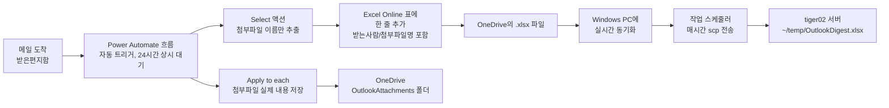

# Outlook 메일 자동 추출 가이드 (Power Automate, 회사 승인 불필요)

> **전제:** 클래식 Outlook COM 자동화는 이 회사 PC에서 차단되어 있음 ([outlook_data_extraction.md](outlook_data_extraction.md) 13절 참고).
> **방식:** 사람이 아무것도 클릭하지 않아도, 메일이 도착하면 Microsoft 클라우드에서 자동으로 실행되는
> Power Automate "흐름(Flow)"이 메일 내용을 OneDrive의 Excel 표에 자동으로 한 줄씩 추가합니다.
> Azure AD 앱 등록이나 관리자 동의가 필요 없는 **기본(무료) 커넥터만** 사용합니다.
> **상태: 2026-07-28 기준 아래 절차 전부 실제로 동작 확인 완료** (Power Automate 흐름 → 첨부파일 포함 Excel 자동 기록 → OneDrive 동기화 → Windows 작업 스케줄러로 tiger02 서버 전달).
> 이 문서는 처음부터 **받는사람(To) / 첨부파일까지 포함**해서 흐름을 만드는 순서로 정리되어 있습니다. 첨부파일이 필요 없다면 4-2, 4-4 단계만 건너뛰면 됩니다.

---

## 1. 이 방식이 하는 일 (요약)



- Outlook이나 PC가 꺼져 있어도 클라우드에서 계속 동작합니다 (Power Automate는 서버 측 자동화).
- 저장 대상은 OneDrive의 Excel 표 + 첨부파일 폴더뿐이라 별도 서버/코드가 필요 없습니다.
- 마우스 개입은 **최초 설정 1회**뿐이고, 이후에는 완전 자동입니다.

---

## 2. 사전 준비

- [X] `https://make.powerautomate.com` 에 회사 계정으로 로그인 가능함 (확인 완료)
- [X] OneDrive for Business 접근 가능함

---

## 3. 1단계: 결과를 저장할 Excel 파일 / 첨부파일 폴더 만들기

Power Automate의 "표에 행 추가" 액션은 **미리 만들어진 Excel 표(Table)** 가 있어야 동작합니다.

1. OneDrive for Business (`https://onedrive.live.com` 또는 `office.com` → OneDrive) 접속
2. 새 Excel 통합 문서 생성 → 이름을 `OutlookDigest.xlsx` 로 저장
3. 첫 번째 행에 아래 6개의 헤더를 입력합니다. (받는사람/첨부파일명을 처음부터 포함)

   | A | B | C | D | E | F |
   |---|---|---|---|---|---|
   | 받은시각 | 보낸사람 | 제목 | 본문 | 받는사람 | 첨부파일명 |

4. 헤더를 포함해서 범위를 선택 → 상단 메뉴 **"Insert" → "Table"** 클릭 → "My table has headers" 체크 → **"OK"**
5. 표 이름을 확인/변경 (기본값은 `Table1`, 나중에 Power Automate에서 이 이름으로 선택합니다. 표를 선택한 상태에서 리본의 **"Table Design"** 탭 → 좌측 상단 이름 칸(`Table1`)에서 원하면 `MailTable` 로 변경해도 됩니다. 지금처럼 `Table1` 그대로 두고 진행해도 무방합니다.)
6. 저장 (OneDrive 문서이므로 자동 저장됩니다)
7. 같은 OneDrive 루트(또는 원하는 위치)에 **첨부파일 실제 내용을 저장할 새 폴더** `OutlookAttachments` 를 만듭니다. (메일 본문에는 첨부파일 "이름"만 기록되고, 실제 파일은 이 폴더에 저장됩니다.)

---

## 4. 2단계: Power Automate 흐름 만들기

1. `https://make.powerautomate.com` 접속
2. 왼쪽 메뉴 **"Create" → "Automated cloud flow"**
3. 흐름 이름 입력 (예: `Outlook 메일 자동 추출`)
4. 트리거 검색창에 `When a new email arrives` 입력 → **"Office 365 Outlook - When a new email arrives (V3)"** 선택 → **Create**
5. 트리거 세부 설정:
   - **Folder**: Inbox (필요하면 특정 폴더로 변경)
   - **Include Attachments**: **Yes** (처음부터 첨부파일까지 저장하는 구성이므로 Yes로 설정합니다. 첨부파일이 전혀 필요 없다면 No로 두고 4-2, 4-4 단계를 건너뛰어도 됩니다.)
   - 나머지 필터(From, Subject Filter 등)는 선택 사항. 전체 메일을 다 받고 싶으면 비워둡니다.
   - ⚠️ **이 Folder에 실제로 들어온 메일만 잡힙니다.** 스팸함(Junk Email)으로 자동 분류되거나, Outlook 규칙이 도착 즉시 다른 폴더로 이동시키는 메일은 Inbox를 거치지 않으므로 기록되지 않습니다. 반대로 일단 Inbox에 들어온 뒤 사람이 나중에 삭제/이동한 메일은 이미 기록이 끝난 뒤라 영향 없습니다.

### 4-1. 첨부파일 이름만 뽑아내는 "Select" 액션 추가

첨부파일은 배열(여러 개)로 오기 때문에, Excel의 한 칸(문자열)에 넣으려면 이름만 미리 뽑아 콤마로 이어 붙여야 합니다.
`select(...)`는 Power Automate의 인라인 수식 함수가 아니므로 (Power Apps의 `Select()`와는 다른 개념), 반드시 아래처럼 **별도의 "Select" 액션**을 써야 합니다.

1. 트리거 바로 다음에 **"+ New step"** 클릭 → `Select` 검색 → **"Data Operation - Select"** 선택
2. **From**: 입력칸 클릭 → Dynamic content에서 `Attachments` **클릭**
3. **Map**: 기본은 `Enter key` / `Enter value` 두 칸으로 된 키-값 모드입니다. 오른쪽의 작은 아이콘(**"Switch to text mode"**)을 클릭해서 입력창 하나로 전환합니다.
4. 전환된 입력창을 **클릭** → 오른쪽에 뜨는 번개 아이콘(⚡)에서 **"Expression"** 탭 선택 → 아래 수식 입력 → **"Add"**(확인):
   ```
   item()?['Name']
   ```
   > ⚠️ 이 칸에 `item()?['Name']`를 수식 편집기 없이 **그냥 텍스트로 직접 타이핑**하면 저장할 때 `Enter a valid JSON.` 오류가 납니다. 위처럼 반드시 Expression 편집기를 통해 넣거나, 직접 타이핑해야 한다면 `@{item()?['Name']}` 처럼 `@{ }`로 감싸서 입력하세요.

### 4-2. "Add a row into a table" 액션 (6개 열 모두 채우기)

1. `Select` 액션 다음에 **"+ New step"** 클릭 → `Excel Online` 검색 → **"Excel Online (Business) - Add a row into a table"** 선택
2. 액션 세부 설정:
   - **Location**: OneDrive for Business
   - **Document Library**: OneDrive
   - **File**: 3단계에서 만든 `OutlookDigest.xlsx` 선택 (파일 찾아보기 아이콘 클릭)
   - **Table**: `Table1` (지금 만든 이름 그대로, 또는 `MailTable`로 바꿨다면 그 이름)
   - 표를 선택하면 열 이름(받은시각/보낸사람/제목/본문/받는사람/첨부파일명)이 자동으로 입력란으로 나타납니다.
   - ⚠️ **아래 이름들을 직접 타이핑하면 안 됩니다.** 각 칸을 **클릭**하면 오른쪽/아래에 번개 아이콘(⚡ **Dynamic content**) 패널이 자동으로 뜨는데, 거기서 아래 이름의 **항목을 클릭**해서 넣어야 합니다. 제대로 넣으면 입력칸 안에 텍스트가 아니라 회색/파란색 **알약 모양 토큰(chip)** 이 생깁니다.
     - 받은시각 칸 → Dynamic content에서 `Received Time` (또는 `Sent Time`) **클릭**
     - 보낸사람 칸 → Dynamic content에서 `From` **클릭**
     - 제목 칸 → Dynamic content에서 `Subject` **클릭**
     - 본문 칸 → Dynamic content에서 `Body` **클릭**
     - 받는사람 칸 → Dynamic content에서 `To` **클릭**
     - 첨부파일명 칸 → 입력란을 클릭 → 번개 아이콘에서 **"Expression"** 탭 → 아래 수식 입력 (첨부파일이 여러 개면 쉼표로 구분된 이름 목록, 없으면 빈 값. `Select` 액션 이름을 바꿨다면 그 이름으로 대체):
       ```
       join(body('Select'), ', ')
       ```
3. 오른쪽 위 **"Save"** 클릭
4. 확인: 액션 오른쪽 위 점 3개(`...`) → **"Peek code"** 클릭 → 값들이 `"item/받은시각": "Received Time"`처럼 **글자 그대로** 보이면 잘못된 것이고, `"item/받은시각": "@{triggerBody()?['DateTimeReceived']}"`처럼 `@{...}` 수식으로 보여야 정상입니다.

> ⚠️ `Body`는 HTML 형식 그대로 저장됩니다 (예: `<div>안녕하세요</div>`). 무료 커넥터만으로는 흐름 안에서
> HTML을 완전히 깨끗한 텍스트로 바꾸기 어렵습니다. 대신 나중에 이 Excel 파일을 읽을 때 Python에서
> HTML 태그를 제거하면 됩니다 (예: `BeautifulSoup(html, "html.parser").get_text()` 또는 `re.sub("<[^<]+?>", "", html)`).
> 원본 텍스트가 꼭 필요하면 Dynamic content 목록에서 `Body Preview`(본문 미리보기, 일반 텍스트지만 일부만 표시)를 대신 써도 됩니다.
>
> ⚠️ 답장(RE) 메일은 보통 이전 대화 내용이 본문 아래에 인용되어 함께 오므로, `Body`에는 새로 쓴 부분뿐 아니라 **스레드 전체가 포함**됩니다. Graph API 차원에는 새 내용만 뽑아주는 `uniqueBody` 속성이 있지만, 이 커넥터의 Dynamic content 목록에 노출되어 있는지는 확인 필요 (Dynamic content 검색창에 "unique" 검색).

### 4-3. "Apply to each" + "Create file" (첨부파일 실제 내용 저장)

1. `Add a row into a table` 액션 **다음**에 새 단계 추가: `Control` 검색 → **"Apply to each"** 선택
   - "Select an output from previous steps" → Dynamic content에서 `Attachments` 클릭
2. "Apply to each" 안에 새 액션 추가: `OneDrive for Business` 검색 → **"Create file"** 선택
   - **Folder Path**: `/OutlookAttachments` (3단계 7번에서 만든 폴더)
   - **File Name**: 필드를 클릭 → Expression 탭 →
     ```
     concat(substring(items('Apply_to_each')?['Name'], 0, sub(length(items('Apply_to_each')?['Name']), add(length(last(split(items('Apply_to_each')?['Name'], '.'))), 1))), '_', substring(guid(), 0, 8), '.', last(split(items('Apply_to_each')?['Name'], '.')))
     ```
     - 결과 형태: `원본파일명_a1b2c3d4.확장자` (예: `report_a1b2c3d4.pdf`)
     - **왜 이런 순서인지**: `concat(A, B, C, ...)`는 인자를 적힌 순서 그대로 이어 붙입니다. 예전 수식 `concat(guid(), '_', 원본이름)`은 무작위 문자열(guid, 36자)이 **맨 앞**에 오는 구조라, OneDrive 폴더에서 이름순으로 정렬하면 전부 무작위 문자열로 시작해 어떤 파일이 어떤 메일의 첨부인지 한눈에 구분하기 어려웠습니다. 위 새 수식은 원본 파일명을 **맨 앞**에 두고, 파일이 겹치지 않도록 짧은 8자리 무작위 문자열만 이름과 확장자 **사이**에 끼워 넣습니다 (확장자를 맨 끝에 그대로 유지해야 더블클릭으로 열 때 파일 종류가 정상 인식됩니다).
     - (`items('Apply_to_each')`의 실제 이름은 "Apply to each" 단계 이름과 일치해야 합니다. Dynamic content에서 `Name`을 먼저 클릭해 넣은 뒤, 그 앞뒤에 나머지 수식을 직접 타이핑하는 방식이 오타를 줄이는 데 더 쉽습니다.)
     - ⚠️ 첨부파일 이름에 **점(.)이 아예 없는 경우**(확장자가 없는 파일)에는 이 수식이 오류를 낼 수 있습니다. 그런 파일을 자주 다룬다면 예전의 단순한 수식(`concat(guid(), '_', items('Apply_to_each')?['Name'])`)으로 되돌려도 됩니다.
   - **File Content**: Dynamic content에서 `Attachments Content` **클릭** (실제 필드명이 이렇습니다. base64 첨부파일 내용을 담고 있음)
3. **Save**

> ⚠️ 첨부파일을 포함하면 흐름이 다루는 데이터량이 커져 실행이 느려지거나, 아주 큰 첨부파일(수십MB 이상)에서는 제한에 걸릴 수 있습니다. 문제가 생기면 트리거의 Include Attachments를 No로 되돌리고 4-1, 4-3 단계를 제거하면 됩니다.

---

## 5. 3단계: 테스트

1. 흐름 화면 상단 **"Test"** 클릭 → **"Manually"** → **"Test"**
2. 자기 자신에게(또는 아무 계정에서) **첨부파일을 하나 붙여서** 테스트 메일 한 통 발송
3. 잠시 후 Power Automate 화면에 흐름 실행이 성공(초록색 체크)으로 표시되는지 확인
4. `OutlookDigest.xlsx` 파일을 열어서 새 행이 추가됐는지, 받는사람/첨부파일명 열까지 채워졌는지 확인
5. OneDrive `OutlookAttachments` 폴더에 실제 첨부파일이 저장됐는지 확인

---

## 6. 4단계: 상시 자동 실행 확인

- 자동화된 클라우드 흐름은 저장하는 순간부터 자동으로 **On** 상태입니다.
- 흐름 목록(`My flows`)에서 상태가 "On"인지 확인하세요.
- 이후로는 Outlook이나 PC를 켜둘 필요 없이, 메일이 도착할 때마다 자동으로 Excel에 쌓입니다.

---

## 7. tiger02 서버로 주기적으로 파일 전달하기 (확인 완료)

`OutlookDigest.xlsx`는 OneDrive에만 쌓입니다. 이걸 `tiger02.lge.com`의 `~/temp/`로 주기적으로 옮기는 절차입니다.
**아래 "실제 동작한 방법"으로 2026-07-27에 최종 확인했습니다.**

### 시도했지만 안 됐던 방법 (참고, 재시도 불필요)

| 방법 | 결과 |
|------|------|
| Linux(tiger)에서 rclone으로 OneDrive 직접 pull | `rclone authorize` 로그인 시 **"Need admin approval"**. 이 회사 Azure AD 테넌트가 모든 제3자 앱에 관리자 동의를 강제하는 정책이라, rclone뿐 아니라 유사한 어떤 OAuth 앱(Graph API 기반)도 이 방식으로는 승인 없이 불가능함 |
| OneDrive 공유 링크 + 인증 없는 curl 다운로드 | Link settings에 "로그인 불필요(Anyone)" 옵션 자체가 없음. "People in LG전자"/"Only people with existing access" 모두 로그인 세션이 필요해 인증 없는 curl은 `Access Denied`(13바이트) 응답만 받음 |
| Power Automate "Copy file" 액션으로 흐름 안에서 바로 SSH 서버에 push | 기본 커넥터로는 임의의 SSH 서버를 목적지로 지정할 수 없음 (SharePoint/OneDrive/Dropbox 등 클라우드 저장소끼리만 가능). 또한 메일마다 매번 복사가 실행되어 비효율적 |

### 실제 동작한 방법: OneDrive 동기화 + Windows 작업 스케줄러 + scp

1. **OneDrive 동기화 확인**: Windows PC에 OneDrive 앱이 로그인되어 있으면 `OutlookDigest.xlsx`가 실시간으로 로컬에 동기화됩니다.
   ```powershell
   echo $env:OneDriveCommercial
   # 예: C:\Users\cheoljoo.lee\OneDrive - LG전자
   ```
2. **[run.bat](run.bat) + [sync_outlook_digest.py](sync_outlook_digest.py)**: 이 둘이 SSH 키 생성/등록, 작업 스케줄러 자동 등록, 파일 전송까지 전부 스스로 처리합니다. 사람은 **최초 1번 `run.bat`을 실행하기만 하면** 됩니다.
   - `run.bat`: `uv`가 없으면 설치(`astral.sh` 공식 설치 스크립트, 관리자 권한 불필요) → `uv run sync_outlook_digest.py` 실행
   - `sync_outlook_digest.py`가 순서대로 확인/처리하는 것:
     1. SSH 키(`~/.ssh/id_rsa`)가 없으면 생성, 있으면 그대로 사용
     2. 서버(`tiger02.lge.com`)에 그 키가 등록되어 있는지 확인 → **등록 안 되어 있을 때만** 등록 (이미 등록돼 있으면 skip)
     3. Windows 작업 스케줄러에 `OutlookDigestSync`라는 이름의 작업(매시간 `run.bat` 실행)이 있는지 확인 → **없을 때만** 등록 (이미 있으면 skip)
     4. `OutlookDigest.xlsx`를 `~/temp/`로 복사
   - 별도 pip 설치가 필요 없습니다 (Windows 내장 OpenSSH `ssh-keygen`/`ssh`/`scp`, `schtasks`만 사용).
   - 모든 단계가 시간과 함께 같은 폴더의 `sync_outlook_digest.log`에 기록됩니다 (append 방식, 계속 누적). 실패 시 이 로그로 "OneDrive에 파일이 없어서(동기화 안 됨)"인지 "서버 연결 실패(서버 다운/네트워크)"인지 구분해서 볼 수 있습니다.
   ```powershell
   cd C:\path\to\outlook-mail-digest
   run.bat
   ```
   - SSH 키가 서버에 아직 등록 안 되어 있던 경우엔 이 최초 실행에서 비밀번호를 한 번 물어봅니다. (지금처럼 키가 이미 등록되어 있다면 처음부터 프롬프트 없이 끝납니다.)
   - 이 한 번의 실행으로 작업 스케줄러 등록까지 끝나므로, **GUI로 작업 스케줄러를 직접 열어 설정할 필요가 없습니다.**
3. **결과 확인**: tiger02에서 아래로 파일 도착 확인
   ```bash
   ls -la ~/temp/OutlookDigest.xlsx
   ```
   Windows 쪽에서도 등록된 작업을 확인할 수 있습니다.
   ```powershell
   schtasks /Query /TN OutlookDigestSync
   ```
   실패했을 때 원인 확인은 로그로:
   ```powershell
   type sync_outlook_digest.log
   ```

> ⚠️ 이 서버(`tiger`, 이 프로젝트 저장소가 있는 곳)와 `tiger02.lge.com`(파일 전달 목적지)은 **서로 다른 머신**입니다. 나중에 xlsx 파싱 스크립트를 어디서 돌릴지 정할 때 주의하세요.

---

## 8. 문제 해결

| 증상 | 원인/해결 |
|------|-----------|
| "Add a row into a table" 액션에서 파일이 안 보임 | 3단계에서 파일을 로컬이 아닌 **OneDrive**에 저장했는지 확인 |
| 흐름은 성공인데 Excel에 행이 안 생김 | "Table" 드롭다운에서 고른 이름(`Table1` 등)이 실제 Excel의 표 이름과 일치하는지, 범위가 실제로 "Table"로 변환되어 있는지("Table Design" 탭이 보이면 정상) 확인 |
| 흐름 생성 시 커넥터 관련 오류/차단 메시지 | 조직의 Power Platform DLP 정책이 이 커넥터 조합을 막은 것. IT 승인 없이는 이 방식 자체가 불가능하다는 뜻이므로, 다른 커넥터 조합(예: SharePoint 리스트)으로 재시도하거나 이 방식을 포기해야 함 |
| 본문에 HTML 태그가 섞여 나옴 | 정상입니다. Python으로 후처리해서 태그를 제거하세요 (7절 참고) |
| 매번 같은 값("Received Time", "From" 등 글자 그대로)이 Excel에 쌓임 / Peek code에 `@{...}` 없이 문자열만 보임 | Dynamic content 칩을 클릭하지 않고 이름을 직접 타이핑한 경우입니다. 4-2절대로 입력칸을 비우고 Dynamic content 목록에서 클릭해서 다시 넣으세요 |
| rclone 등에서 로그인 시 "Need admin approval" 화면이 뜸 | 테넌트 정책상 모든 제3자 앱에 관리자 동의가 강제됨. 이 경로는 포기하고 7절의 OneDrive 동기화 + 작업 스케줄러 방식 사용 |
| PowerShell에서 `%OneDriveCommercial%`가 그대로 문자열로 남고 경로 치환이 안 됨 | `%VAR%`는 cmd.exe(배치파일) 전용 문법입니다. PowerShell 프롬프트에서 직접 테스트하려면 `$env:OneDriveCommercial`을 쓰거나, `.bat` 파일 자체를 실행해서 테스트하세요 |
| 설정 중 client_secret/sshpass 등에 실수로 실제 비밀번호를 입력함 | 즉시 해당 계정 비밀번호를 변경하세요. 자동화에는 비밀번호 대신 SSH 키 인증(7절)을 사용해 비밀번호 자체를 스크립트/채팅에 남기지 않는 것이 원칙입니다 |
| "Add a row into a table"에서 `InvalidTemplate ... 'select' is not defined or not valid` 오류 | `select(...)`는 Power Automate 인라인 수식 함수가 아닙니다(Power Apps의 `Select()`와 다름). 4-1절처럼 별도의 "Data Operation - Select" 액션을 추가해서 처리하세요 |
| "Select" 액션 저장 시 Flow checker에 `Enter a valid JSON.` 오류 | Map을 텍스트 모드로 바꾼 뒤 `item()?['Name']`를 수식 편집기 없이 그냥 텍스트로 타이핑하면 JSON으로 파싱되지 않아 발생합니다. 4-1절처럼 Expression 편집기(⚡ → Expression 탭)로 넣거나, 직접 입력해야 한다면 `@{item()?['Name']}`처럼 `@{ }`로 감싸서 입력하세요 |
| OneDrive `OutlookAttachments` 폴더에서 파일이 전부 무작위 문자열로 시작해 어떤 메일 첨부인지 구분이 안 됨 | 4-3절의 File Name 수식에서 guid가 이름 맨 앞에 오도록 되어 있었기 때문입니다. 4-3절에 안내된 새 수식(원본 이름이 앞, 짧은 8자리 무작위 문자열이 이름과 확장자 사이)으로 바꾸세요 |
