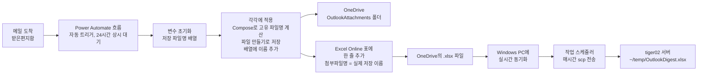

# Outlook 메일 자동 추출 가이드 (Power Automate, 회사 승인 불필요) — 한글 UI 메뉴 버전

> **이 문서는 [my_outlook_power_automate_setup.md](my_outlook_power_automate_setup.md)와 완전히 동일한 내용**이며, Power Automate 화면 언어가 **한국어**로 설정된 경우를 위해 메뉴/버튼 이름만 한글로 바꾼 버전입니다.
> 화면이 영문으로 나온다면 원본 문서([my_outlook_power_automate_setup.md](my_outlook_power_automate_setup.md))를 사용하세요.
> ⚠️ 일부 용어(특히 "Apply to each", "Compose" 같은 제어/데이터 작업 액션의 **박스 제목**)는 Power Automate 버전이나 테넌트 언어 설정에 따라 한글 대신 영문 그대로 표시될 수 있습니다. 이런 액션은 **검색은 한글로, 만들어진 뒤 박스 제목은 아래 안내대로 영문(`Apply to each`, `Compose`)으로 맞춰두는 것**을 권장합니다 — 그래야 원본 문서에서 이미 실제 동작 검증까지 끝난 수식을 그대로 재사용할 수 있습니다.

> **전제:** 클래식 Outlook COM 자동화는 이 회사 PC에서 차단되어 있음 ([outlook_data_extraction.md](outlook_data_extraction.md) 13절 참고).
> **방식:** 사람이 아무것도 클릭하지 않아도, 메일이 도착하면 Microsoft 클라우드에서 자동으로 실행되는
> Power Automate "흐름(Flow)"이 메일 내용을 OneDrive의 Excel 표에 자동으로 한 줄씩 추가합니다.
> Azure AD 앱 등록이나 관리자 동의가 필요 없는 **기본(무료) 커넥터만** 사용합니다.
> **상태: 2026-07-28 기준 아래 절차 전부 실제로 동작 확인 완료** (Power Automate 흐름 → 첨부파일 포함 Excel 자동 기록 → OneDrive 동기화 → Windows 작업 스케줄러로 tiger02 서버 전달).
> 이 문서는 처음부터 **받는사람(To) / 첨부파일까지 포함**해서 흐름을 만드는 순서로 정리되어 있습니다. 첨부파일이 필요 없다면 4-1, 4-2 단계는 건너뛰고 4-3의 첨부파일명 칸만 비워두면 됩니다.

---

## 0. 빠른 시작 (이미 만들어진 흐름을 그대로 가져오기)

1~9절을 처음부터 따라 하며 직접 만들 필요 없이, 이미 완성해서 내보낸 흐름 파일 [Get_Outlook_Mail_20260728014316.zip](Get_Outlook_Mail_20260728014316.zip)을 이 저장소에서 바로 가져올 수 있습니다 (2026-07-28 기준 실제 동작 확인 완료된 버전입니다). 자기 메일함/OneDrive로 그대로 동작하게 하려면 아래 순서를 그대로 따르세요.

1. `https://make.powerautomate.com` 접속 → 왼쪽 메뉴 **"내 흐름"** → **"가져오기"**
2. 이 저장소의 [Get_Outlook_Mail_20260728014316.zip](Get_Outlook_Mail_20260728014316.zip) 파일을 업로드
3. 화면에 이 흐름이 쓰는 연결(연결) 목록이 뜹니다: `Office 365 Outlook`, `Excel Online (Business)`, `OneDrive for Business`
4. 각 연결 항목 오른쪽에서 **"가져오는 동안 선택"** → **"새로 만들기"** 선택 → 팝업에서 **본인 회사 계정으로 로그인**
   - ⚠️ 이 단계를 빠뜨리면 흐름이 원작성자(이철주)의 연결을 그대로 재사용하려다 권한 오류가 나거나, 본인이 실행한 흐름인데 **이철주의 메일함을 계속 감시**하게 될 수 있습니다. 반드시 각자 계정으로 새로 연결하세요.
5. **"가져오기"** 클릭 → 완료되면 본인의 "내 흐름" 목록에 흐름이 생기고 자동으로 **켜짐(사용)** 상태가 됩니다.
6. 흐름 안에 이미 포함된 4-0절의 자동 준비 로직 덕분에, 본인 OneDrive에 Excel 파일(`OutlookDigest.xlsx`)과 첨부파일 폴더(`OutlookAttachments`)를 따로 만들 필요가 없습니다. 흐름을 켜는 순간 자동으로 준비됩니다 (첨부파일 폴더는 첫 메일이 도착할 때 생성됨).
7. **"테스트" → "수동으로"**로 한 번 실행해 보고, 자신에게 첨부파일 있는 메일을 하나 보내서 `OutlookDigest.xlsx`에 새 행이 생기는지 확인합니다 (5절 "테스트" 참고).
8. 이렇게 가져온 흐름을 직접 수정하고 싶거나, 동작 원리/각 단계의 의미를 자세히 알고 싶다면 아래 1절부터 순서대로 읽으며 비교하세요. 오류가 나면 8절 "문제 해결" 표를 먼저 확인하세요.

> ℹ️ 이 zip은 §9-1의 "내가 할 일(내보내기)"을 이미 수행해 둔 결과물입니다. 흐름을 수정한 뒤 새로 내보내려면 §9-1을 참고하세요.

---

## 1. 이 방식이 하는 일 (요약)



- Outlook이나 PC가 꺼져 있어도 클라우드에서 계속 동작합니다 (Power Automate는 서버 측 자동화).
- 저장 대상은 OneDrive의 Excel 표 + 첨부파일 폴더뿐이라 별도 서버/코드가 필요 없습니다.
- 마우스 개입은 **최초 설정 1회**뿐이고, 이후에는 완전 자동입니다.

---

## 2. 사전 준비

- [X] `https://make.powerautomate.com` 에 회사 계정으로 로그인 가능함 (확인 완료)
- [X] OneDrive for Business 접근 가능함

---

## 3. 1단계: 결과를 저장할 Excel 파일 / 첨부파일 폴더 만들기

Power Automate의 "표에 행 추가" 액션은 **미리 만들어진 Excel 표(Table)** 가 있어야 동작합니다.

1. OneDrive for Business (`https://onedrive.live.com` 또는 `office.com` → OneDrive) 접속
2. 새 Excel 통합 문서 생성 → 이름을 `OutlookDigest.xlsx` 로 저장
3. 첫 번째 행에 아래 6개의 헤더를 입력합니다. (받는사람/첨부파일명을 처음부터 포함)

   | A | B | C | D | E | F |
   |---|---|---|---|---|---|
   | 받은시각 | 보낸사람 | 제목 | 본문 | 받는사람 | 첨부파일명 |

4. 헤더를 포함해서 범위를 선택 → 상단 메뉴 **"삽입" → "표"** 클릭 → "머리글 포함" 체크 → **"확인"**
5. 표 이름을 확인/변경 (기본값은 `표1`, 나중에 Power Automate에서 이 이름으로 선택합니다. 표를 선택한 상태에서 리본의 **"표 디자인"** 탭 → 좌측 상단 이름 칸(`표1`)에서 원하면 `MailTable` 로 변경해도 됩니다. 지금처럼 `표1` 그대로 두고 진행해도 무방합니다.)
6. 저장 (OneDrive 문서이므로 자동 저장됩니다)
7. 같은 OneDrive 루트(또는 원하는 위치)에 **첨부파일 실제 내용을 저장할 새 폴더** `OutlookAttachments` 를 만듭니다. (메일 본문에는 첨부파일 "이름"만 기록되고, 실제 파일은 이 폴더에 저장됩니다.)

---

## 4. 2단계: Power Automate 흐름 만들기

1. `https://make.powerautomate.com` 접속
2. 왼쪽 메뉴 **"만들기" → "자동화된 클라우드 흐름"**
3. 흐름 이름 입력 (예: `Outlook 메일 자동 추출`)
4. 트리거 검색창에 `새 이메일이 도착하면` 입력 → **"Office 365 Outlook - 새 이메일이 도착하면(V3)"** 선택 → **만들기**
5. 트리거 세부 설정:
   - **폴더**: 받은 편지함 (필요하면 특정 폴더로 변경)
   - **첨부 파일 포함**: **예** (처음부터 첨부파일까지 저장하는 구성이므로 예로 설정합니다. 첨부파일이 전혀 필요 없다면 아니요로 두고 4-1, 4-2 단계를 건너뛰어도 됩니다.)
   - 나머지 필터(보낸사람, 제목 필터 등)는 선택 사항. 전체 메일을 다 받고 싶으면 비워둡니다.
   - ⚠️ **이 폴더에 실제로 들어온 메일만 잡힙니다.** 스팸함(정크 메일)으로 자동 분류되거나, Outlook 규칙이 도착 즉시 다른 폴더로 이동시키는 메일은 받은 편지함을 거치지 않으므로 기록되지 않습니다. 반대로 일단 받은 편지함에 들어온 뒤 사람이 나중에 삭제/이동한 메일은 이미 기록이 끝난 뒤라 영향 없습니다.

### 4-0. OutlookDigest.xlsx / OutlookAttachments 폴더가 없으면 자동으로 준비하기

이 흐름을 다른 사람이 그대로 가져다 써도, 3단계처럼 매번 사람이 직접 Excel 표를 만들거나 폴더를 만들 필요가 없도록 트리거 바로 다음에 "없으면 자동으로 만드는" 단계를 추가합니다. 이미 3단계를 통해 파일/폴더를 만들어 둔 사람에게는 아래 확인 단계들이 전부 실패(빨간 X)로 표시되지만, 그건 "이미 있다"는 뜻이라 **정상**이며 뒤 단계는 그대로 진행됩니다.

**준비 (최초 1회, 이철주가 함)**

1. 첨부파일 없이 헤더 6개 + `표1`만 있는 빈 견본 파일을 `OutlookDigest_starting_sample.xlsx`라는 이름으로 준비합니다.
2. OneDrive에서 이 파일을 우클릭 → **"공유"** 선택 (실수로 "액세스 관리"를 눌렀다면 그 패널에서 파란색 **"공유 시작"** 링크를 클릭하면 동일한 화면으로 이동합니다)
   - "공유" 창 하단의 **"링크 복사"** 버튼 바로 오른쪽에 있는 **톱니바퀴(⚙️) 아이콘**을 클릭 → 링크 설정 창에서 **"LG전자의 사용자"**(사내 전체, 추천) 선택 → **적용**
     - 팀원만 지정하고 싶으면 대신 **"선택한 사용자"** 를 선택합니다.
   - 링크 설정에서 적용한 뒤 다시 "공유" 창으로 돌아오면, 이름을 입력하지 말고 **"링크 복사"** 버튼만 눌러서 공유를 완료합니다 ("보내기"는 이메일로 알림을 보내는 기능이라 필요 없습니다).
   - 이렇게 공유해두면 다른 사람의 Power Automate 파일 선택창에서 **"공유됨"** 항목 아래에 이 파일이 보입니다.

**흐름에 추가할 단계 (트리거 바로 다음, 4-1 "변수 초기화" 액션보다 앞)**

> ⚠️ OneDrive for Business 커넥터에는 **"새 폴더 만들기"라는 액션 자체가 없습니다** ("작업 추가" 목록에 파일 만들기/파일 복사/파일 가져오기 계열만 있고 폴더 생성 액션은 없음). 대신 `OutlookAttachments` 폴더는 **4-2절의 "파일 만들기"가 그 폴더 경로로 처음 저장을 시도할 때 없으면 자동으로 만들어집니다** (SharePoint/OneDrive 계열 "파일 만들기" 액션의 공통 동작: 대상 폴더 경로가 없으면 자동 생성). 그래서 여기서는 `OutlookDigest.xlsx` 파일 준비만 다루면 됩니다.

1. **"+ 새 단계"** → `OneDrive for Business` 검색 → **"경로를 사용하여 파일 메타데이터 가져오기"** 선택
   - **파일 경로**: `/OutlookDigest.xlsx`
   - 흐름의 첫 단계이므로 "실행 후" 설정은 건드릴 필요 없습니다 (기본값 그대로).
   - 내 OneDrive에 파일이 이미 있는지만 확인하는 단계입니다. 파일이 없으면 이 단계는 실패(빨간 X)합니다. 정상입니다.
2. 그 다음 **"+ 새 단계"** → `OneDrive for Business` 검색 → **"파일 콘텐츠 가져오기"** 선택
   - 파일 선택창에서 **"공유됨"** 항목 아래, 이철주가 공유한 `OutlookDigest_starting_sample.xlsx` 선택
   - 이 액션을 클릭해서 선택한 상태에서 왼쪽 패널의 **"설정"** 탭 클릭 → **"실행 후"** 섹션에 바로 앞 액션("경로를 사용하여 파일 메타데이터 가져오기")이 이미 나열되어 있음 → 그 옆의 **상태 점(●) 아이콘** 클릭 → 체크박스 펼쳐짐 → **"성공"** 체크 해제, **"실패"** 만 체크 (즉, 1번이 실패했을 때 = 내 OneDrive에 파일이 없을 때만 이 단계가 실행됨. 별도 저장 버튼 없이 바로 적용됨)
3. 캔버스에서 방금 만든 **"파일 콘텐츠 가져오기"** 박스 바로 아래의 **"+"** 아이콘 클릭 → `OneDrive for Business` 검색 → **"파일 만들기"** 선택
   - **폴더 경로**: `/`
   - **파일 이름**: `OutlookDigest.xlsx`
   - **File Content(파일 내용)**: 2번 단계("파일 콘텐츠 가져오기")의 출력(파일 콘텐츠) 클릭
   - "실행 후" 설정은 기본값(2번이 성공했을 때) 그대로 둡니다.

> ℹ️ 바로 다음 §4-1에서 "변수 초기화" 액션을 만든 뒤, 그 액션의 "실행 후"를 이 "파일 만들기"(3번)에 맞춰 마저 설정해야 합니다 (§4-1 마지막 단계에 안내되어 있습니다). 아직 "변수 초기화" 액션 자체가 없으므로 지금은 건너뜁니다.

동작 순서 요약: **내 OutlookDigest.xlsx 있는지 확인 → 없으면 이철주의 견본 파일을 내 OneDrive로 복사 → (있든 없든) 원래 흐름 그대로 진행 → 4-2절에서 첫 첨부파일을 저장할 때 OutlookAttachments 폴더가 없으면 자동 생성**. 흐름을 처음 켜는 순간 자동으로 자기 OneDrive에 `OutlookDigest.xlsx`가 준비되고, 첫 메일(첨부파일 포함)이 도착하면 `OutlookAttachments` 폴더도 자동 생성되므로, 3단계의 수동 작업을 건너뛰어도 됩니다. (만약 실제로 폴더 자동 생성이 안 되는 것을 확인하면, 3단계 7번처럼 OneDrive에서 `OutlookAttachments` 폴더를 한 번만 수동으로 만들어 두면 됩니다.)

### 4-1. 첨부파일 저장 이름을 모아둘 변수 만들기

Excel의 "첨부파일명" 열에 **실제로 OneDrive에 저장된 파일 이름**을 그대로 기록하려면, 첨부파일마다 반복하며 계산한 고유 이름을 어딘가에 모아뒀다가 나중에(반복이 다 끝난 뒤) Excel에 한 줄로 써야 합니다. 이를 위한 배열 변수를 미리 만듭니다.

1. 트리거 바로 다음에 **"+ 새 단계"** 클릭 → `초기화` 검색 → **"변수"** 카테고리 아래 **"변수 초기화"** 선택 (`데이터 작업` 카테고리가 아닙니다)
2. **이름**: `varAttachmentNames`
3. **형식**: `배열`
4. **값**: 비워둡니다 (배열 형식은 값을 안 넣어도 빈 배열 `[]`로 시작합니다)
5. **저장**
6. 이 액션을 클릭 → **"설정"** 탭 → **"실행 후"** 섹션에서 바로 앞의 **"파일 만들기"**(§4-0의 3번)에 대해 **"성공"**, **"실패"**, **"건너뜀"** 를 모두 체크
   - 이렇게 해야 "파일이 이미 있어서 §4-0 1번은 성공하고 2, 3번은 건너뛴 경우"와 "파일이 없어서 §4-0 1번은 실패했지만 2, 3번으로 새로 만든 경우" 모두 뒤 이어지는 흐름이 정상 진행됩니다.

### 4-2. "각각에 적용" + "Compose" + "파일 만들기" + "배열 변수에 추가" (첨부파일마다 반복 저장)

> ⚠️ "각각에 적용"과 "Compose"는 **컨트롤/데이터 작업 계열의 기본 액션**이라 UI 언어 설정과 무관하게 캔버스에 영문 `Apply to each`, `Compose`로 표시되는 경우가 흔합니다. 검색은 한글(`각각에 적용`, `데이터 작업`)로 하되, 실제 박스 제목이 무엇으로 뜨는지 확인하고, 아래 수식은 **박스 제목이 정확히 `Apply to each`(숫자 없이)** 인 것을 전제로 작성되어 있다는 점에 유의하세요.

1. `변수 초기화` 액션 다음에 새 단계 추가: `제어` 검색 → **"각각에 적용"** 선택
   - "이전 단계에서 출력 선택" → 동적 콘텐츠에서 `첨부 파일(Attachments)` 클릭
2. "각각에 적용" 안에 첫 액션 추가: `데이터 작업` 검색 → **"Compose"** 선택
   - ⚠️ 아래 수식은 "각각에 적용"(Apply to each) 박스 제목이 **숫자 없이 정확히 `Apply to each`** 인 것을 전제로 합니다 (새로 만들면 기본적으로 이 이름입니다. 한글 UI에서 "각각에 적용"으로 표시된다면 박스 제목을 클릭해서 `Apply to each`로 바꿔두는 것을 권장합니다). 만약 캔버스에 `Apply to each 1`처럼 숫자가 붙어 있다면, 내부 참조 이름도 `Apply_to_each_1`이 되어 아래 수식과 이름이 달라지므로 저장 시 `InvalidTemplate: The repetition action(s) 'Apply_to_each' referenced by 'inputs' in action 'Compose' are not defined in the template.` 오류가 납니다. 이 경우 박스 제목 옆 이름을 클릭해서 `Apply to each`로 바꾸거나(숫자 제거), 수식 안의 `Apply_to_each`를 실제 이름에 맞게 고치세요.
   - **입력** 필드 클릭 → **식** 탭 → 아래 수식 입력:
     ```
     concat(substring(items('Apply_to_each')?['Name'], 0, sub(length(items('Apply_to_each')?['Name']), add(length(last(split(items('Apply_to_each')?['Name'], '.'))), 1))), '_', formatDateTime(convertTimeZone(utcNow(), 'UTC', 'Korea Standard Time'), 'yyyyMMdd_HHmmss'), '_', substring(guid(), 0, 8), '.', last(split(items('Apply_to_each')?['Name'], '.')))
     ```
     - 결과 형태: `원본파일명_yyyyMMdd_HHmmss_a1b2c3d4.확장자` (예: `report_20260728_174700_a1b2c3d4.pdf`, 한국 시간(KST, UTC+9) 기준)
     - **왜 이런 순서인지**: `concat(A, B, C, ...)`는 인자를 적힌 순서 그대로 이어 붙입니다. 원본 파일명을 **맨 앞**에 두고, 그 뒤에 **받은 날짜_시각**(한국 시간 기준 `yyyyMMdd_HHmmss`)을 붙여 언제 도착한 첨부인지 바로 알 수 있게 하고, 혹시 같은 이름의 파일이 같은 시각에 겹치는 경우까지 대비해 짧은 8자리 무작위 문자열을 마지막으로 덧붙입니다. 확장자는 맨 끝에 그대로 유지해야 더블클릭으로 열 때 파일 종류가 정상 인식됩니다.
     - ⚠️ **왜 반드시 "Compose"로 한 번만 계산해야 하는가**: 이 수식에는 `guid()`(호출할 때마다 매번 다른 무작위 값을 반환하는 함수)가 들어 있습니다. 만약 이 수식을 뒤에 나올 "파일 만들기"의 파일 이름 칸과 "배열 변수에 추가"의 값 칸에 **각각 따로** 입력하면, `guid()`가 두 번 호출되어 서로 **다른 값**이 나오고, 결국 Excel에 기록되는 이름과 실제 OneDrive에 저장되는 파일 이름이 서로 달라져 버립니다. 반드시 "Compose" 액션 **하나로만** 계산한 뒤, 그 결과(`outputs('Compose')`)를 아래 두 곳에서 그대로 재사용해야 정확히 일치합니다.
     - ⚠️ 첨부파일 이름에 **점(.)이 아예 없는 경우**(확장자가 없는 파일)에는 이 수식이 오류를 낼 수 있습니다. 그런 파일을 자주 다룬다면 예전의 단순한 수식(`concat(guid(), '_', items('Apply_to_each')?['Name'])`)으로 되돌려도 됩니다.
     - ⚠️ `convertTimeZone(utcNow(), 'UTC', 'Korea Standard Time')`으로 이미 **한국 시간(UTC+9)** 으로 변환한 값을 씁니다. UTC 기준 시각을 그대로 쓰고 싶다면 이 부분을 `utcNow()`로 되돌리면 됩니다.
3. **"각각에 적용" 박스 안**, 방금 만든 "Compose" 액션 바로 밑의 **"+"** 아이콘 클릭 → `OneDrive for Business` 검색 → **"파일 만들기"** 선택 (박스 바깥이 아니라 안쪽에 추가해야, 첨부파일마다 반복 실행됩니다)
   - **폴더 경로**: `/OutlookAttachments` (3단계 7번에서 만든 폴더)
   - **파일 이름**: 입력칸 클릭 → 동적 콘텐츠에서 방금 만든 **`Compose`의 출력** 클릭 (또는 식 탭에서 `outputs('Compose')` 직접 입력)
   - **File Content(파일 내용)**: 동적 콘텐츠에서 `Attachments Content`(첨부 파일 콘텐츠) **클릭** (실제 필드명이 이렇습니다. base64 첨부파일 내용을 담고 있음)
4. 역시 **"각각에 적용" 박스 안**, 방금 만든 "파일 만들기" 바로 밑의 **"+"** 아이콘 클릭 → `변수` 검색 → **"배열 변수에 추가"** 선택
   - **이름**: `varAttachmentNames`
   - **값**: 동적 콘텐츠에서 **`Compose`의 출력** 클릭 (또는 `outputs('Compose')`)
5. **저장**

> ⚠️ 첨부파일을 포함하면 흐름이 다루는 데이터량이 커져 실행이 느려지거나, 아주 큰 첨부파일(수십MB 이상)에서는 제한에 걸릴 수 있습니다. 문제가 생기면 트리거의 첨부 파일 포함을 아니요로 되돌리고 4-1, 4-2 단계를 제거하면 됩니다.

### 4-3. "표에 행 추가" 액션 (각각에 적용 바깥, 6개 열 모두 채우기)

⚠️ 이 액션은 반드시 **"각각에 적용" 박스가 끝난 다음(바깥)** 에 추가해야 합니다. 박스 **안**에 넣으면 첨부파일 개수만큼 Excel에 같은 메일이 중복으로 기록됩니다.

1. `각각에 적용` 박스가 끝난 바로 다음 줄에 **"+ 새 단계"** 클릭 → `Excel Online` 검색 → **"Excel Online (Business) - 표에 행 추가"** 선택
2. 액션 세부 설정:
   - **위치**: OneDrive for Business
   - **문서 라이브러리**: OneDrive
   - **파일**: 3단계에서 만든 `OutlookDigest.xlsx` 선택 (파일 찾아보기 아이콘 클릭)
   - **표**: `표1` (지금 만든 이름 그대로, 또는 `MailTable`로 바꿨다면 그 이름)
   - 표를 선택하면 열 이름(받은시각/보낸사람/제목/본문/받는사람/첨부파일명)이 자동으로 입력란으로 나타납니다.
   - ⚠️ **아래 이름들을 직접 타이핑하면 안 됩니다.** 각 칸을 **클릭**하면 오른쪽/아래에 번개 아이콘(⚡ **동적 콘텐츠**) 패널이 자동으로 뜨는데, 거기서 아래 이름의 **항목을 클릭**해서 넣어야 합니다. 제대로 넣으면 입력칸 안에 텍스트가 아니라 회색/파란색 **알약 모양 토큰(chip)** 이 생깁니다.
     - 받은시각 칸 → 동적 콘텐츠에서 `Received Time`(수신 시간) (또는 `Sent Time`) **클릭**
     - 보낸사람 칸 → 동적 콘텐츠에서 `From`(보낸 사람) **클릭**
     - 제목 칸 → 동적 콘텐츠에서 `Subject`(제목) **클릭**
     - 본문 칸 → 동적 콘텐츠에서 `Body`(본문) **클릭**
     - 받는사람 칸 → 동적 콘텐츠에서 `To`(받는 사람) **클릭**
     - 첨부파일명 칸 → 입력란을 클릭 → 번개 아이콘에서 **"식"** 탭 → 아래 수식 입력 (4-2에서 모아둔 배열을 쉼표로 이어붙임 — 이 값은 OneDrive에 실제로 저장된 파일 이름과 **정확히 일치**합니다):
       ```
       join(variables('varAttachmentNames'), ', ')
       ```
3. 오른쪽 위 **"저장"** 클릭
4. 확인: **"표에 행 추가"** 액션 클릭 → 상세 패널 상단의 **매개 변수 / 설정 / 코드 보기 / 테스트 / 정보** 탭 중 **"코드 보기"** 탭 클릭 → 값들이 `"item/받은시각": "Received Time"`처럼 **글자 그대로** 보이면 잘못된 것이고, `"item/받은시각": "@triggerOutputs()?['body/receivedDateTime']"`처럼 `@...` 수식으로 보여야 정상입니다.

> ⚠️ `Body`(본문)는 HTML 형식 그대로 저장됩니다 (예: `<div>안녕하세요</div>`). 무료 커넥터만으로는 흐름 안에서
> HTML을 완전히 깨끗한 텍스트로 바꾸기 어렵습니다. 대신 나중에 이 Excel 파일을 읽을 때 Python에서
> HTML 태그를 제거하면 됩니다 (예: `BeautifulSoup(html, "html.parser").get_text()` 또는 `re.sub("<[^<]+?>", "", html)`).
> 원본 텍스트가 꼭 필요하면 동적 콘텐츠 목록에서 `Body Preview`(본문 미리보기, 일반 텍스트지만 일부만 표시)를 대신 써도 됩니다.
>
> ⚠️ 답장(RE) 메일은 보통 이전 대화 내용이 본문 아래에 인용되어 함께 오므로, `Body`에는 새로 쓴 부분뿐 아니라 **스레드 전체가 포함**됩니다. Graph API 차원에는 새 내용만 뽑아주는 `uniqueBody` 속성이 있지만, 이 커넥터의 동적 콘텐츠 목록에 노출되어 있는지는 확인 필요 (동적 콘텐츠 검색창에 "unique" 검색).

---

## 5. 3단계: 테스트

1. 흐름 화면 상단 **"테스트"** 클릭 → **"수동으로"** → **"테스트"**
2. 자기 자신에게(또는 아무 계정에서) **첨부파일을 하나 붙여서** 테스트 메일 한 통 발송
   - ⚠️ 이 흐름은 **받은편지함(Inbox)에 도착한 메일만** 감지합니다. 스팸함(정크 메일)으로 자동 분류되거나, Outlook 규칙(rule)이 도착 즉시 다른 폴더로 이동시키는 메일은 받은 편지함을 거치지 않으므로 처리되지 않습니다. 테스트 메일이 필터링 규칙 없이 받은 편지함에 그대로 남는지 확인하세요.
3. 잠시 후 Power Automate 화면에 흐름 실행이 성공(초록색 체크)으로 표시되는지 확인
4. `OutlookDigest.xlsx` 파일을 열어서 새 행이 추가됐는지, 받는사람/첨부파일명 열까지 채워졌는지 확인
5. OneDrive `OutlookAttachments` 폴더에 실제 첨부파일이 저장됐는지 확인
6. Excel의 첨부파일명 열 값과 OneDrive `OutlookAttachments` 폴더에 저장된 실제 파일 이름이 **글자 하나까지 정확히 일치**하는지 확인 (일치하지 않으면 4-2절의 "Compose" 액션을 빠뜨리고 파일 만들기/배열 변수에 추가에 각각 수식을 따로 넣은 것은 아닌지 확인)

---

## 6. 4단계: 상시 자동 실행 확인

- 자동화된 클라우드 흐름은 저장하는 순간부터 자동으로 **켜짐(사용)** 상태입니다.
- 흐름 목록(`내 흐름`)에서 상태가 "켜짐"인지 확인하세요.
- 이후로는 Outlook이나 PC를 켜둘 필요 없이, 메일이 도착할 때마다 자동으로 Excel에 쌓입니다.

---

## 7. tiger02 서버로 주기적으로 파일 전달하기 (확인 완료)

`OutlookDigest.xlsx`는 OneDrive에만 쌓입니다. 이걸 `tiger02.lge.com`의 `~/temp/`로 주기적으로 옮기는 절차입니다.
**아래 "실제 동작한 방법"으로 2026-07-27에 최종 확인했습니다.**

### 시도했지만 안 됐던 방법 (참고, 재시도 불필요)

| 방법 | 결과 |
|------|------|
| Linux(tiger)에서 rclone으로 OneDrive 직접 pull | `rclone authorize` 로그인 시 **"Need admin approval"**. 이 회사 Azure AD 테넌트가 모든 제3자 앱에 관리자 동의를 강제하는 정책이라, rclone뿐 아니라 유사한 어떤 OAuth 앱(Graph API 기반)도 이 방식으로는 승인 없이 불가능함 |
| OneDrive 공유 링크 + 인증 없는 curl 다운로드 | 링크 설정에 "로그인 불필요(모든 사용자)" 옵션 자체가 없음. "LG전자의 사용자"/"기존에 액세스 권한이 있는 사용자만" 모두 로그인 세션이 필요해 인증 없는 curl은 `Access Denied`(13바이트) 응답만 받음 |
| Power Automate "파일 복사" 액션으로 흐름 안에서 바로 SSH 서버에 push | 기본 커넥터로는 임의의 SSH 서버를 목적지로 지정할 수 없음 (SharePoint/OneDrive/Dropbox 등 클라우드 저장소끼리만 가능). 또한 메일마다 매번 복사가 실행되어 비효율적 |

### 실제 동작한 방법: OneDrive 동기화 + Windows 작업 스케줄러 + scp

1. **OneDrive 동기화 확인**: Windows PC에 OneDrive 앱이 로그인되어 있으면 `OutlookDigest.xlsx`가 실시간으로 로컬에 동기화됩니다.
   ```powershell
   echo $env:OneDriveCommercial
   # 예: C:\Users\cheoljoo.lee\OneDrive - LG전자
   ```
2. **[run.bat](run.bat) + [sync_outlook_digest.py](sync_outlook_digest.py)**: 이 둘이 SSH 키 생성/등록, 작업 스케줄러 자동 등록, 파일 전송까지 전부 스스로 처리합니다. 사람은 **최초 1번 `run.bat`을 실행하기만 하면** 됩니다.
   - `run.bat`: `uv`가 없으면 설치(`astral.sh` 공식 설치 스크립트, 관리자 권한 불필요) → `uv run sync_outlook_digest.py` 실행
   - `sync_outlook_digest.py`가 순서대로 확인/처리하는 것:
     1. SSH 키(`~/.ssh/id_rsa`)가 없으면 생성, 있으면 그대로 사용
     2. 서버(`tiger02.lge.com`)에 그 키가 등록되어 있는지 확인 → **등록 안 되어 있을 때만** 등록 (이미 등록돼 있으면 skip)
     3. Windows 작업 스케줄러에 `OutlookDigestSync`라는 이름의 작업(매시간 `run.bat` 실행)이 있는지 확인 → **없을 때만** 등록 (이미 있으면 skip)
     4. `OutlookDigest.xlsx`를 `~/temp/`로 복사
   - 별도 pip 설치가 필요 없습니다 (Windows 내장 OpenSSH `ssh-keygen`/`ssh`/`scp`, `schtasks`만 사용).
   - 모든 단계가 시간과 함께 같은 폴더의 `sync_outlook_digest.log`에 기록됩니다 (append 방식, 계속 누적). 실패 시 이 로그로 "OneDrive에 파일이 없어서(동기화 안 됨)"인지 "서버 연결 실패(서버 다운/네트워크)"인지 구분해서 볼 수 있습니다.
   ```powershell
   cd C:\path\to\outlook-mail-digest
   run.bat
   ```
   - SSH 키가 서버에 아직 등록 안 되어 있던 경우엔 이 최초 실행에서 비밀번호를 한 번 물어봅니다. (지금처럼 키가 이미 등록되어 있다면 처음부터 프롬프트 없이 끝납니다.)
   - 이 한 번의 실행으로 작업 스케줄러 등록까지 끝나므로, **GUI로 작업 스케줄러를 직접 열어 설정할 필요가 없습니다.**
3. **결과 확인**: tiger02에서 아래로 파일 도착 확인
   ```bash
   ls -la ~/temp/OutlookDigest.xlsx
   ```
   Windows 쪽에서도 등록된 작업을 확인할 수 있습니다.
   ```powershell
   schtasks /Query /TN OutlookDigestSync
   ```
   실패했을 때 원인 확인은 로그로:
   ```powershell
   type sync_outlook_digest.log
   ```

> ⚠️ 이 서버(`tiger`, 이 프로젝트 저장소가 있는 곳)와 `tiger02.lge.com`(파일 전달 목적지)은 **서로 다른 머신**입니다. 나중에 xlsx 파싱 스크립트를 어디서 돌릴지 정할 때 주의하세요.

---

## 8. 문제 해결

| 증상 | 원인/해결 |
|------|-----------|
| "표에 행 추가" 액션에서 파일이 안 보임 | 3단계에서 파일을 로컬이 아닌 **OneDrive**에 저장했는지 확인 |
| 흐름은 성공인데 Excel에 행이 안 생김 | "표" 드롭다운에서 고른 이름(`표1` 등)이 실제 Excel의 표 이름과 일치하는지, 범위가 실제로 "표"로 변환되어 있는지("표 디자인" 탭이 보이면 정상) 확인 |
| 흐름 생성 시 커넥터 관련 오류/차단 메시지 | 조직의 Power Platform DLP 정책이 이 커넥터 조합을 막은 것. IT 승인 없이는 이 방식 자체가 불가능하다는 뜻이므로, 다른 커넥터 조합(예: SharePoint 리스트)으로 재시도하거나 이 방식을 포기해야 함 |
| 본문에 HTML 태그가 섞여 나옴 | 정상입니다. Python으로 후처리해서 태그를 제거하세요 (7절 참고) |
| 매번 같은 값("Received Time", "From" 등 글자 그대로)이 Excel에 쌓임 / 코드 보기에 `@{...}` 없이 문자열만 보임 | 동적 콘텐츠 칩을 클릭하지 않고 이름을 직접 타이핑한 경우입니다. 4-3절대로 입력칸을 비우고 동적 콘텐츠 목록에서 클릭해서 다시 넣으세요 |
| rclone 등에서 로그인 시 "Need admin approval" 화면이 뜸 | 테넌트 정책상 모든 제3자 앱에 관리자 동의가 강제됨. 이 경로는 포기하고 7절의 OneDrive 동기화 + 작업 스케줄러 방식 사용 |
| PowerShell에서 `%OneDriveCommercial%`가 그대로 문자열로 남고 경로 치환이 안 됨 | `%VAR%`는 cmd.exe(배치파일) 전용 문법입니다. PowerShell 프롬프트에서 직접 테스트하려면 `$env:OneDriveCommercial`을 쓰거나, `.bat` 파일 자체를 실행해서 테스트하세요 |
| 설정 중 client_secret/sshpass 등에 실수로 실제 비밀번호를 입력함 | 즉시 해당 계정 비밀번호를 변경하세요. 자동화에는 비밀번호 대신 SSH 키 인증(7절)을 사용해 비밀번호 자체를 스크립트/채팅에 남기지 않는 것이 원칙입니다 |
| "표에 행 추가"에서 `InvalidTemplate ... 'select' is not defined or not valid` 오류 | `select(...)`는 Power Automate 인라인 수식 함수가 아닙니다(Power Apps의 `Select()`와 다름). 지금 구조는 별도의 "Select" 액션 자체를 쓰지 않으므로(4-2절 Compose로 대체), 이 오류가 나면 어딘가에 `select(...)`를 인라인으로 입력한 곳이 있는지 확인하세요 |
| Excel의 첨부파일명과 OneDrive에 실제 저장된 파일 이름이 서로 다름 | 4-2절의 "Compose" 액션 없이 "파일 만들기"의 파일 이름과 "배열 변수에 추가"의 값에 파일명 수식을 각각 따로 입력한 경우입니다. `guid()`가 호출될 때마다 다른 값을 반환하므로 두 값이 달라집니다. 반드시 "Compose"로 한 번만 계산하고 `outputs('Compose')`를 두 곳에서 재사용하세요 |
| OneDrive `OutlookAttachments` 폴더에서 파일이 전부 무작위 문자열로 시작해 어떤 메일 첨부인지 구분이 안 됨 | 4-2절의 "Compose" 수식에서 guid가 이름 맨 앞에 오도록 되어 있었기 때문입니다. 4-2절에 안내된 새 수식(원본 이름이 앞, 그 뒤에 받은 날짜_시각, 마지막에 짧은 8자리 무작위 문자열, 확장자는 그대로 끝에 유지)으로 바꾸세요 |
| "표에 행 추가"가 Excel에 첨부파일 개수만큼 중복된 줄을 만듦 | "표에 행 추가" 액션을 "각각에 적용" 박스 **안**에 넣은 경우입니다. 4-3절처럼 반드시 박스 **바깥(다음)** 으로 옮기세요 |
| 흐름 저장 시 `InvalidTemplate ... The repetition action(s) 'Apply_to_each' referenced by 'inputs' in action 'Compose' are not defined in the template` 오류 | "각각에 적용"(Apply to each) 박스의 실제 제목(예: `Apply to each 1`)과 Compose 수식 안에서 참조한 이름(`Apply_to_each`)이 서로 다른 경우입니다. 흐름 안에 "각각에 적용"이 하나뿐이라면, 박스 제목의 이름을 클릭해서 숫자 없이 **`Apply to each`** 로 바꾸는 것이 가장 간단한 해결책입니다 (문서의 Compose 수식과 정확히 일치하게 됨) |
| 흐름을 가져오기한 동료가 실행했는데 계속 원작성자(나)의 메일함/OneDrive만 감시함 | 가져오기 시 각 연결을 "새로 만들기"로 본인 계정으로 새로 연결하지 않고 그대로 진행한 경우입니다. 9-1절대로 가져오기 화면에서 각 연결마다 "가져오는 동안 선택" → "새로 만들기" → 본인 계정 로그인을 반드시 거쳐야 합니다 |
| 회사 Power Automate에서 가져오기(패키지 가져오기) 자체가 안 되거나 오류가 남 | 조직 정책상 가져오기 기능 자체가 차단된 것입니다. 9-2절의 "공유 + 작업 복사/붙여넣기" 방식을 대신 사용하세요. 이 방식은 가져오기 기능을 전혀 쓰지 않으므로 이 정책의 영향을 받지 않습니다 |
| 9-2절 방식으로 붙여넣은 뒤 저장 시 `InvalidTemplate ... The repetition action(s) 'Apply_to_each' referenced by 'inputs' in action 'Compose' are not defined in the template` 오류 | "작업 붙여넣기" 직후 자동으로 붙는 `-copy` 접미사(`Apply to each-copy`, `Compose-copy`) 때문입니다. 9-2절 4)번 안내대로 붙여넣은 박스 이름에서 `-copy`를 지워 정확히 `Apply to each`, `Compose`로 되돌리세요 |
| "경로를 사용하여 파일 메타데이터 가져오기" 단계가 빨간 X(실패)로 표시됨 | 4-0절에서는 **이 실패가 정상**입니다 (`OutlookDigest.xlsx` 파일이 이미 있다는 뜻). 다음 단계를 클릭 → "설정" 탭 → "실행 후" 섹션에 "실패"/"건너뜀"이 체크되어 있는지 확인하세요. 전체 흐름의 마지막 결과가 초록색 체크면 문제 없습니다 |
| OneDrive for Business 커넥터의 "작업 추가" 목록에 "새 폴더 만들기"가 없음 | 정상입니다. 이 커넥터에는 폴더 생성 전용 액션이 없습니다. 4-0절 안내대로 `OutlookAttachments` 폴더는 4-2절의 "파일 만들기"가 그 경로로 처음 저장할 때 자동 생성됩니다 (자동 생성이 안 되는 것을 확인하면 3단계 7번처럼 한 번만 수동으로 만들어 두세요) |

---

## 9. 다른 사람도 그대로 가져다 쓸 수 있게 만들기

지금까지 만든 흐름을 동료도 자기 메일함/OneDrive 기준으로 그대로 쓰게 하려면, 아래 두 방법 중 하나를 쓰면 됩니다. Excel 파일(표1 포함) 자동 준비와 첨부파일 폴더 자동 생성은 이미 4-0절에서 흐름 안에 포함시켰으므로, 어느 방법을 쓰든 동료는 최소한의 수작업만으로 나머지가 전부 자동으로 준비됩니다.

| | 방법 A: 내보내기 → 가져오기 | 방법 B: 공유 + 작업 복사/붙여넣기 |
|---|---|---|
| 전제 조건 | 조직에서 흐름 **가져오기**(패키지 가져오기)가 막혀 있지 않아야 함 | **가져오기가 막혀 있어도 사용 가능** (가져오기 기능 자체를 아예 쓰지 않음) |
| 동료가 할 일 | zip 파일 하나만 가져오기 | 새 흐름을 직접 만들고, 원본 흐름에서 액션을 몇 개 묶어서 복사 → 붙여넣기 |
| 소요 시간 | 짧음 (1~2분) | 조금 더 걸림 (5~10분, 액션 묶음 4개 정도 복사/붙여넣기) |
| 언제 쓰나 | 조직에서 가져오기가 허용될 때 | **회사 정책상 가져오기 자체가 차단된 경우** (이 문서의 기본 시나리오) |

> ⚠️ 이 회사(테넌트)처럼 **가져오기가 막혀 있다면 방법 A(9-1)는 시도해도 실패**하므로, 바로 **방법 B(9-2)** 로 진행하세요. Power Automate 디자이너의 "작업 복사"/"작업 붙여넣기" 기능은 같은 흐름 안에서뿐 아니라 **서로 다른 흐름 사이에서도** 공식적으로 지원되며([Microsoft Learn: 클라우드 흐름 디자이너 살펴보기](https://learn.microsoft.com/ko-kr/power-automate/flows-designer) "복사 및 붙여넣기 작업" 절 참고), 가져오기(패키지 가져오기)와는 완전히 다른 기능이라 조직의 가져오기 차단 정책에 걸리지 않습니다.

### 9-1. 방법 A: 흐름을 "패키지"로 내보내서 동료에게 전달하기 (가져오기가 가능한 경우)

Power Automate의 "공유" 기능으로 흐름을 같이 소유하게 할 수도 있지만, 그렇게 하면 트리거가 여전히 **원작성자(이 흐름을 처음 만든 사람, 예: 이철주)의 메일함만** 감시합니다. 동료가 **자기 메일함**을 감시하는 자기만의 흐름을 가지려면 반드시 **내보내기 → 가져오기** 방식을 써야 합니다.

**내가 할 일 (1회)**

✅ 이미 완료됨: 이 저장소의 [Get_Outlook_Mail_20260728014316.zip](Get_Outlook_Mail_20260728014316.zip)이 아래 절차로 내보내 둔 결과물입니다 (0절 "빠른 시작"에서 바로 사용할 수 있습니다). 흐름을 수정한 뒤 다시 내보내야 할 때만 아래 절차를 반복하면 됩니다.

1. `https://make.powerautomate.com` → 왼쪽 **"내 흐름"**
2. 흐름 오른쪽 점 3개(`...`) → **"내보내기"** → **"패키지(.zip)"**
3. 파일 이름 확인 후 **"내보내기"** 클릭 → zip 파일 다운로드
4. 이 zip 파일을 사내 공유 드라이브나 메일로 동료에게 전달 (또는 이 저장소에 새 파일명으로 커밋)

**동료가 할 일 (1회, 받는 사람마다 반복)**

1. `https://make.powerautomate.com` → **"내 흐름"** → **"가져오기"**
2. 방금 받은 zip 파일 업로드
3. 화면에 이 흐름이 쓰는 연결 목록이 뜹니다: `Office 365 Outlook`, `Excel Online (Business)`, `OneDrive for Business`
4. 각 연결 항목 오른쪽에서 **"가져오는 동안 선택"** → **"새로 만들기"** 선택 → 팝업에서 **본인 회사 계정으로 로그인**
   - ⚠️ 이 단계를 빠뜨리면 흐름이 원작성자(나)의 연결을 그대로 재사용하려다 권한 오류가 나거나, 동료가 실행한 흐름인데 **내 메일함을 계속 감시**하게 될 수 있습니다. 반드시 각자 계정으로 새로 연결하세요.
5. **"가져오기"** 클릭 → 완료되면 동료의 "내 흐름" 목록에 흐름이 생기고 자동으로 **켜짐(사용)** 상태가 됩니다.
6. 4-0절의 자동 준비 로직이 흐름 안에 이미 포함되어 있으므로, 동료는 Excel 파일이나 첨부파일 폴더를 따로 만들 필요가 없습니다.

### 9-2. 방법 B: 공유 + 작업 복사/붙여넣기로 동료의 흐름 만들기 (가져오기가 차단된 경우)

가져오기 기능 자체를 전혀 쓰지 않고, Power Automate 디자이너의 **"작업 복사" / "작업 붙여넣기"** 기능을 이용해 동료가 자기 흐름을 직접 조립하는 방법입니다. 이 기능은 같은 흐름 안에서는 물론 **서로 다른 흐름 사이**에서도 액션(원자적 액션이든 "각각에 적용" 같은 컨테이너 액션이든)을 복사해서 붙여넣을 수 있도록 공식적으로 지원되며, 가져오기가 막혀 있어도 그대로 동작합니다. "공유"로 흐름을 열람/편집할 수 있게만 공유하면 됩니다.

**1) 내가 할 일: 원본 흐름을 동료에게 공유**

1. `https://make.powerautomate.com` → **"내 흐름"** → 이 흐름 오른쪽 점 3개(`...`) → **"공유"**
2. 공유 화면의 **"소유자"**(또는 공유 대상 입력란)에 동료의 이름/이메일 추가 → 저장
   - ⚠️ 이렇게 공유해도 트리거는 여전히 **내(원작성자) 메일함만** 감시합니다. 이 공유의 목적은 어디까지나 동료가 원본 흐름의 내용을 열람하고 액션을 복사할 수 있게 하기 위함이며, 동료가 실제로 쓸 흐름은 아래 2)에서 새로 만드는 흐름입니다.

**2) 동료가 할 일: 자기만의 새 흐름을 만들고, 원본에서 액션을 복사해서 붙여넣기**

1. 먼저 **자기 흐름을 새로 생성**: **"만들기"** → **"자동화된 클라우드 흐름"** → 트리거 검색 `새 이메일이 도착하면` → **"Office 365 Outlook - 새 이메일이 도착하면(V3)"** 선택 → **본인 계정**으로 트리거 연결 (4절 1~5번과 동일하게 폴더/첨부 파일 포함 여부까지 설정)
2. 공유받은 원본 흐름을 별도 브라우저 탭에서 열기 ("내 흐름" 목록의 **"공유받음"** 탭 또는 유사한 탭에 표시됨)
3. 원본 흐름에서 **위에서부터 순서대로** 아래 단위로 하나씩 복사합니다. 복사할 액션을 마우스 오른쪽 버튼으로 클릭 → **"작업 복사"** (또는 액션 선택 후 `Ctrl+C`) → 자신의 새 흐름 탭으로 이동 → 붙여넣을 위치의 캔버스 **"+"** 를 마우스 오른쪽 버튼으로 클릭 → **"작업 붙여넣기"** (또는 `Ctrl+V`)
   - ① §4-0의 "경로를 사용하여 파일 메타데이터 가져오기" ~ "파일 만들기" (파일 자동 준비 로직, 필요하면)
   - ② §4-1의 "변수 초기화" (`varAttachmentNames`)
   - ③ §4-2의 **"각각에 적용" 박스 전체** — 컨테이너 액션이므로 이것 하나를 복사하면 안에 있는 `Compose`/파일 만들기/배열 변수에 추가까지 통째로 복사됩니다.
   - ④ §4-3의 "표에 행 추가"
4. ⚠️ **매우 중요 (이름 확인)**: 붙여넣은 직후 액션 이름 뒤에 자동으로 **`-copy`** 가 붙습니다 (예: `Apply to each` → `Apply to each-copy`, `Compose` → `Compose-copy` — 이 접미사는 한글 UI에서도 영문 그대로 `-copy`로 붙습니다). 이 프로젝트의 수식(`items('Apply_to_each')`, `outputs('Compose')`)은 정확히 `Apply to each`, `Compose`라는 이름을 전제로 하므로, 붙여넣은 뒤 **박스 이름을 클릭해서 `-copy`를 지우고 원래 이름(`Apply to each`, `Compose`)으로 되돌리세요.** 그렇지 않으면 저장 시 8절 문제 해결 표에 있는 것과 동일한 `InvalidTemplate ... referenced by 'inputs' ... are not defined in the template` 오류가 납니다.
5. **연결(Connection) 다시 설정**: 붙여넣은 `OneDrive for Business`/`Excel Online (Business)`/`Office 365 Outlook` 액션은 원본 소유자(나)의 연결을 그대로 참조하려고 시도할 수 있습니다. 액션을 클릭했을 때 연결 오류 경고나 연결 선택 드롭다운이 보이면, 반드시 **동료 자신의 계정으로 새 연결(새로 만들기)** 을 만들어 선택하세요. (같은 커넥터를 한 번만 새로 연결하면, 같은 커넥터를 쓰는 다른 액션들도 자동으로 그 연결을 같이 쓰게 됩니다.)
6. 순서(위→아래)가 원본과 같은지, 트리거 바로 다음부터 §4-0 → §4-1 → §4-2("각각에 적용") → §4-3("표에 행 추가") 순서로 이어지는지 확인
7. **저장** → 저장 시 오류(빨간 X)가 나면 대부분 4)~5)의 이름/연결 문제이므로 8절 문제 해결 표를 같이 참고하세요.

### 9-3. 최종 확인 (두 방법 공통)

1. 어느 방법으로 만들었든 **"테스트" → "수동으로"**로 한 번 실행합니다.
2. 실행 결과에서 "경로를 사용하여 파일 메타데이터 가져오기"나 "새 폴더 만들기"가 빨간 X로 나와도, **전체 흐름이 초록색 체크로 끝나는지** 확인합니다 (실행 후 설정이 제대로 됐다는 뜻).
3. `OutlookDigest.xlsx`, `OutlookAttachments` 폴더가 실제로 동료 자신의 OneDrive에 자동 생성됐는지 확인합니다.
4. 방법 A(9-1)를 쓸 수 있는 조직이라면 그 zip을 그대로 재활용하면 되고, 방법 B(9-2)로 진행했다면 이렇게 완성한 동료의 흐름을 그 다음 사람에게 전달할 때도 똑같이 9-2 절차(공유 → 액션 복사/붙여넣기)를 반복하면 됩니다.
