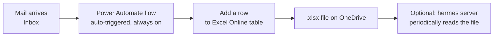

# Outlook Mail Auto-Extraction Guide (Power Automate, No Company Approval Needed)

> **Prerequisite:** Classic Outlook COM automation is blocked on this company PC (see section 13 of [outlook_data_extraction.md](outlook_data_extraction.md)).
> **Approach:** With zero manual clicking after setup, a Power Automate "Flow" runs automatically in
> Microsoft's cloud whenever a new mail arrives, and appends the mail content as a new row in an Excel
> table on OneDrive. Only **standard (free) connectors** are used, so no Azure AD app registration or
> admin consent is required.

---

## 1. What This Does (Overview)

- Runs in the cloud even if Outlook or your PC is turned off (Power Automate is server-side automation).
- The only destination is a single Excel table on OneDrive, so no extra server or code is needed.
- Manual/mouse involvement is required **once, during setup**. After that it's fully automatic.

---

## 2. Prerequisites

- [x] Can sign in to `https://make.powerautomate.com` with your company account (confirmed)
- [x] Have access to OneDrive for Business

---

## 3. Step 1: Create the Excel File to Store Results

The "Add a row into a table" action in Power Automate requires a **pre-created Excel Table**.

1. Go to OneDrive for Business (`https://onedrive.live.com` or via `office.com` → OneDrive)
2. Create a new Excel workbook → save it as `OutlookDigest.xlsx`
3. In the first row, enter the following 4 headers:

   | A | B | C | D |
   |---|---|---|---|
   | ReceivedTime | From | Subject | Body |

4. Select the range including the headers → top menu **"Insert" → "Table"** → check "My table has headers" → OK
5. Check/rename the table name (default is `Table1`; you'll pick this name later in Power Automate. Optionally rename it to `MailTable` from the **"Table Design"** tab.)
6. Save (OneDrive documents auto-save)

---

## 4. Step 2: Build the Power Automate Flow

1. Go to `https://make.powerautomate.com`
2. Left menu **"Create" → "Automated cloud flow"**
3. Enter a flow name (e.g. `Outlook Mail Auto Extract`)
4. In the trigger search box type `When a new email arrives` → select **"Office 365 Outlook - When a new email arrives (V3)"** → **Create**
5. Trigger settings:
   - **Folder**: Inbox (change to a specific folder if needed)
   - **Include Attachments**: No (avoids size issues)
   - Other filters (From, Subject Filter, etc.) are optional. Leave blank to capture all mail.
6. Click **"+ New step"** → search `Excel Online` → select **"Excel Online (Business) - Add a row into a table"**
7. Action settings:
   - **Location**: OneDrive for Business
   - **Document Library**: OneDrive
   - **File**: select the `OutlookDigest.xlsx` created in Step 1 (use the file-picker icon)
   - **Table**: `Table1` (or `MailTable`)
   - Once you select the table, the column names (ReceivedTime/From/Subject/Body) appear as input fields. Click each field and map it from the **Dynamic content** list as below:
     - ReceivedTime → `Received Time` (or `Sent Time`)
     - From → `From`
     - Subject → `Subject`
     - Body → `Body`
8. Click **"Save"** in the top right

> ⚠️ `Body` is saved as raw HTML (e.g. `
Hello
`). With free connectors alone, it's hard to fully
> strip HTML inside the flow. Instead, strip the tags later in Python when reading this Excel file
> (e.g. `BeautifulSoup(html, "html.parser").get_text()` or `re.sub("<[^<]+?>", "", html)`).
> If you need plain text directly, you can use `Body Preview` (a plain-text preview, but truncated) from
> the Dynamic content list instead.

---

## 5. Step 3: Test

1. At the top of the flow screen click **"Test"** → **"Manually"** → **"Test"**
2. Send yourself (or from any account) one test email
3. After a moment, confirm the flow run shows success (green checkmark) in Power Automate
4. Open `OutlookDigest.xlsx` and confirm a new row was added

---

## 6. Step 4: Confirm It Stays Running Automatically

- An automated cloud flow is automatically **On** the moment you save it.
- In your flow list (`My flows`), confirm the status shows "On".
- From now on, you don't need to keep Outlook or your PC running — every new mail is automatically appended to the Excel table.

---

## 7. (Optional) Have the hermes Server Pull the Data Periodically

`OutlookDigest.xlsx` only accumulates data on OneDrive. If another program on the hermes server (e.g. kanban
integration) needs to consume this data, use whichever of these your company policy allows.

| Method | Description |
|--------|-------------|
| OneDrive sync client | Set up a OneDrive sync folder on an approved company PC, and have hermes periodically read from that folder |
| Add a "Copy file" step in Power Automate | After "Add a row into a table", add a "Copy file" action to also save a copy to a location reachable inside the company network |

---

## 8. Troubleshooting

| Symptom | Cause / Fix |
|---------|-------------|
| File doesn't appear in the "Add a row into a table" action | Confirm the file was saved to **OneDrive**, not locally, in Step 1 |
| Flow succeeds but no row appears in Excel | Check that the table name matches the actual Excel table name, and that it's really formatted as a "Table" (not just a plain range) |
| Error/blocked message about connectors when creating the flow | Your organization's Power Platform DLP policy is blocking this connector combination. This means the approach itself isn't possible without IT approval — try a different connector combination (e.g. SharePoint list) or abandon this approach |
| HTML tags show up mixed into the body | Expected. Strip the tags in Python during post-processing (see Section 4's note) |
