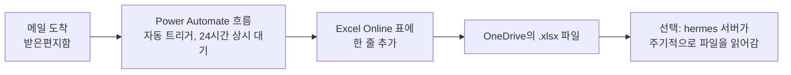

# Outlook 메일 자동 추출 가이드 (Power Automate, 회사 승인 불필요)

> **전제:** 클래식 Outlook COM 자동화는 이 회사 PC에서 차단되어 있음 ([outlook_data_extraction.md](outlook_data_extraction.md) 13절 참고).
> **방식:** 사람이 아무것도 클릭하지 않아도, 메일이 도착하면 Microsoft 클라우드에서 자동으로 실행되는
> Power Automate "흐름(Flow)"이 메일 내용을 OneDrive의 Excel 표에 자동으로 한 줄씩 추가합니다.
> Azure AD 앱 등록이나 관리자 동의가 필요 없는 **기본(무료) 커넥터만** 사용합니다.

---

## 1. 이 방식이 하는 일 (요약)

- Outlook이나 PC가 꺼져 있어도 클라우드에서 계속 동작합니다 (Power Automate는 서버 측 자동화).
- 저장 대상은 OneDrive의 Excel 표 하나뿐이라 별도 서버/코드가 필요 없습니다.
- 마우스 개입은 **최초 설정 1회**뿐이고, 이후에는 완전 자동입니다.

---

## 2. 사전 준비

- [X] `https://make.powerautomate.com` 에 회사 계정으로 로그인 가능함 (확인 완료)
- [X] OneDrive for Business 접근 가능함

---

## 3. 1단계: 결과를 저장할 Excel 파일 만들기

Power Automate의 "표에 행 추가" 액션은 **미리 만들어진 Excel 표(Table)** 가 있어야 동작합니다.

1. OneDrive for Business (`https://onedrive.live.com` 또는 `office.com` → OneDrive) 접속
2. 새 Excel 통합 문서 생성 → 이름을 `OutlookDigest.xlsx` 로 저장
3. 첫 번째 행에 아래 4개의 헤더를 입력합니다.

   | A | B | C | D |
   |---|---|---|---|
   | 받은시각 | 보낸사람 | 제목 | 본문 |

4. 헤더를 포함해서 범위를 선택 → 상단 메뉴 **"삽입" → "표"** 클릭 → "머리글 포함" 체크 → 확인
5. 표 이름을 확인/변경 (기본값은 `표1`, 나중에 Power Automate에서 이 이름으로 선택합니다. 원하면 "표 디자인" 탭에서 `MailTable` 로 변경해도 됩니다.)
6. 저장 (OneDrive 문서이므로 자동 저장됩니다)

---

## 4. 2단계: Power Automate 흐름 만들기

1. `https://make.powerautomate.com` 접속
2. 왼쪽 메뉴 **"만들기" → "자동화된 클라우드 흐름"**
3. 흐름 이름 입력 (예: `Outlook 메일 자동 추출`)
4. 트리거 검색창에 `새 이메일이 도착하면` 입력 → **"Office 365 Outlook - 새 이메일이 도착하면(V3)"** 선택 → **만들기**
5. 트리거 세부 설정:
   - **폴더**: 받은 편지함 (필요하면 특정 폴더로 변경)
   - **첨부 파일 포함**: 아니요 (용량 문제 방지)
   - 나머지 필터(보낸사람, 제목에 포함된 단어 등)는 선택 사항. 전체 메일을 다 받고 싶으면 비워둡니다.
6. **"+ 새 단계"** 클릭 → `Excel Online` 검색 → **"Excel Online (Business) - 표에 행 추가"** 선택
7. 액션 세부 설정:
   - **위치**: OneDrive for Business
   - **문서 라이브러리**: OneDrive
   - **파일**: 3단계에서 만든 `OutlookDigest.xlsx` 선택 (파일 찾아보기 아이콘 클릭)
   - **표**: `표1` (또는 `MailTable`)
   - 표를 선택하면 열 이름(받은시각/보낸사람/제목/본문)이 자동으로 입력란으로 나타납니다. 각 칸을 클릭하고 **동적 콘텐츠** 목록에서 아래처럼 매핑합니다.
     - 받은시각 → `Received Time` (또는 `Sent Time`)
     - 보낸사람 → `From`
     - 제목 → `Subject`
     - 본문 → `Body`
8. 오른쪽 위 **"저장"** 클릭

> ⚠️ `Body`는 HTML 형식 그대로 저장됩니다 (예: `
안녕하세요
`). 무료 커넥터만으로는 흐름 안에서
> HTML을 완전히 깨끗한 텍스트로 바꾸기 어렵습니다. 대신 나중에 이 Excel 파일을 읽을 때 Python에서
> HTML 태그를 제거하면 됩니다 (예: `BeautifulSoup(html, "html.parser").get_text()` 또는 `re.sub("<[^<]+?>", "", html)`).
> 원본 텍스트가 꼭 필요하면 동적 콘텐츠 목록에서 `Body Preview`(본문 미리보기, 일반 텍스트지만 일부만 표시)를 대신 써도 됩니다.

---

## 5. 3단계: 테스트

1. 흐름 화면 상단 **"테스트"** 클릭 → **"수동으로"** → **"테스트"**
2. 자기 자신에게(또는 아무 계정에서) 테스트 메일 한 통 발송
3. 잠시 후 Power Automate 화면에 흐름 실행이 성공(초록색 체크)으로 표시되는지 확인
4. `OutlookDigest.xlsx` 파일을 열어서 새 행이 추가됐는지 확인

---

## 6. 4단계: 상시 자동 실행 확인

- 자동화된 클라우드 흐름은 저장하는 순간부터 자동으로 **켜짐(사용)** 상태입니다.
- 흐름 목록(`내 흐름`)에서 상태가 "켜짐"인지 확인하세요.
- 이후로는 Outlook이나 PC를 켜둘 필요 없이, 메일이 도착할 때마다 자동으로 Excel에 쌓입니다.

---

## 7. (선택) hermes 서버에서 주기적으로 데이터 가져가기

`OutlookDigest.xlsx`는 OneDrive에 쌓이기만 합니다. 이 데이터를 hermes 서버의 다른 프로그램(kanban 연동 등)이
쓰게 하려면 아래 중 회사 정책이 허용하는 방법을 사용하세요.

| 방법 | 설명 |
|------|------|
| OneDrive 동기화 클라이언트 | 승인된 회사 PC에 OneDrive 동기화 폴더를 만들고, 그 폴더를 hermes가 주기적으로 읽어가게 함 |
| Power Automate에서 파일을 공유 드라이브로 복사하는 단계 추가 | "표에 행 추가" 뒤에 "파일 복사" 액션을 붙여 사내에서 접근 가능한 위치로도 사본 저장 |

---

## 8. 문제 해결

| 증상 | 원인/해결 |
|------|-----------|
| "표에 행 추가" 액션에서 파일이 안 보임 | 3단계에서 파일을 로컬이 아닌 **OneDrive**에 저장했는지 확인 |
| 흐름은 성공인데 Excel에 행이 안 생김 | 표 이름이 실제 Excel의 표 이름과 일치하는지, 표가 파일 안에 실제로 "표(Table)"로 변환되어 있는지 확인 |
| 흐름 생성 시 커넥터 관련 오류/차단 메시지 | 조직의 Power Platform DLP 정책이 이 커넥터 조합을 막은 것. IT 승인 없이는 이 방식 자체가 불가능하다는 뜻이므로, 다른 커넥터 조합(예: SharePoint 리스트)으로 재시도하거나 이 방식을 포기해야 함 |
| 본문에 HTML 태그가 섞여 나옴 | 정상입니다. Python으로 후처리해서 태그를 제거하세요 (7절 참고) |
